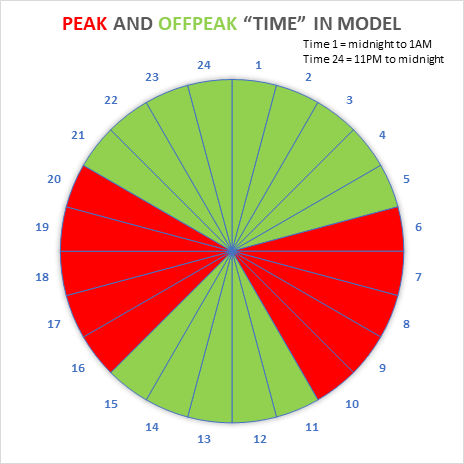

## README 

### Hour definition used in the code
- hour 1 is midnight to 1:00am, hour 24 is 11:00pm to midnight
- example - hour 6 in the code will period 5:00am to 6:00am, hour 10 will be 9:00am to 10:00am
- example - hour 16 will be period 3:00pm to 4:00pm, hour 20 will be 7:00pm to 8:00pm

### Perk period definition
- am peak: 5:00am to 10:00am
- pm peak: 3:00pm to 8:00pm
- revise the property file to reflect new period definition, if needed

### POE RATE File Input
- Code is reading the values using the TIME field from this file
- Values in the TIME column should be 1 through 24. If you have row for TIME 25, DELETE it!
- HOUR column is not required in this file. If you have HOUR in there, DELETE it!

