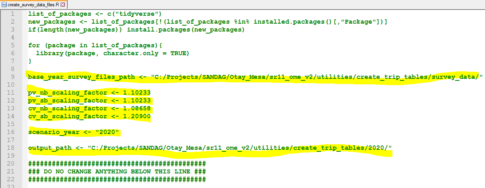
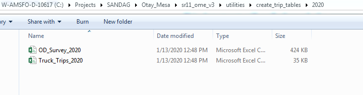
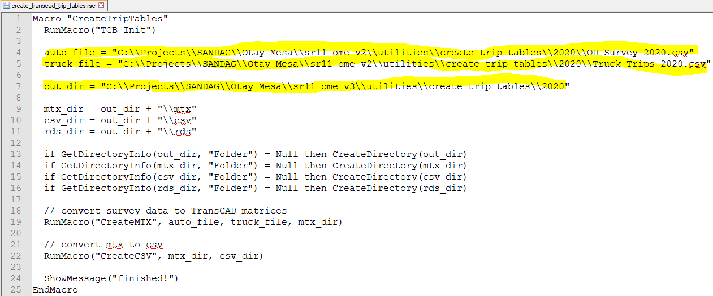
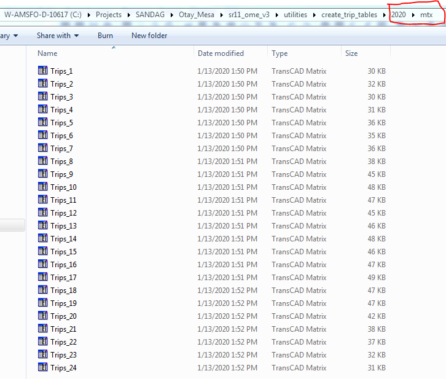
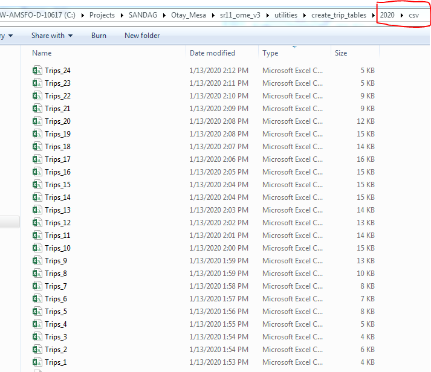
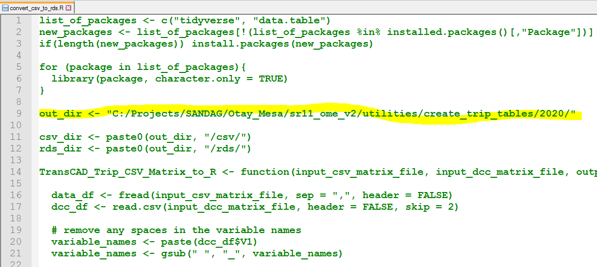
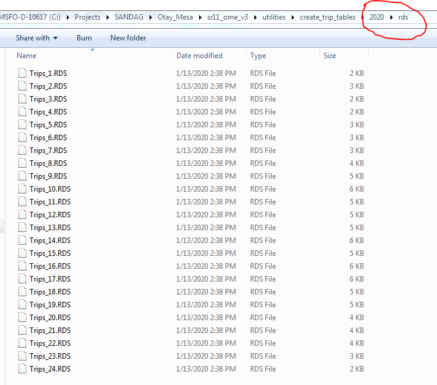

# Create Scenario Trip Tables

To run the Otay Mesa model, scenario specific trip tables are required as input to the model. This document summarizes the steps to create those trips tables for any given scenario. 

The trip tables that are input to the model are a matrix of origin and destination trips for cross-border trips between United States and Mexico. There are trip tables for each purpose and lane type for each hour of the day. There are three main automobile purposes: home-based work (HBW), home-based other (HBO) and home-based shop (HBS); and two truck purposes – Loaded and Empty. The auto purposes were further divided into three lane types: General, Ready and SENTRI, while truck purposes were divided into GP and FAST.

There is a [create trip tables](./../utilities/create_trip_tables) folder in the utilities folder of the model directory which has all the required scripts to run this process and create scenario trip tables. 

#### Software Needs

* You will need to have R installed on your computer (version 3.5.1 was the version used to develop the model).  [Here](<https://cran.r-project.org/bin/windows/base/old/3.5.1/>) is the link to download R (3.5.1), if required. Any other newer R version (say 3.4.1 or 3.5.2 etc.) will work too. It will be a good idea to get [RStudio](https://rstudio.com/products/rstudio/download/) to be able to easily run the R script for this process. 

* You will also need TransCAD 6.0 installed on your machine. 

Here are the detailed steps to create the scenario specific trip tables: 

#### i. Create Scenario Specific Survey Data Files

First step is to create the scenario specific passenger and commercial vehicle survey data CSV files. These files are created by using the base year survey data and factoring them up to match the scenario growth forecast for both passenger and commercial vehicles. Base year (2017) survey data files are located in the `survey_data` folder as OD_Survey_2017.csv and Truck_Trips_2017.csv for passenger and commercial vehicles respectively. 

Here is the growth forecast for year 2020, 2030 and 2040 used as the control totals to create the 2020, 2030 and 2040 year specific survey data files. 

| Year | Passenger Vehicle Forecast (NB) | Commercial Vehicle Forecast (NB) | Commercial Vehicle Forecast (SB) |
| :--- | ------------------------------- | -------------------------------- | -------------------------------- |
| 2017 | 61,250                          | 3,488                            | 3,488                            |
| 2020 | 67,518                          | 3,790                            | 4,217                            |
| 2030 | 78,365                          | 4,798                            | 5,255                            |
| 2040 | 92,184                          | 5,806                            | 6,294                            |

**This document will walk through the process of creating year <u>2020 trip tables</u> using the base year (2017) trip data.** 

Open the 2017 files and get the total sum of passenger and commercial trips *by direction*. Make sure it matches the 2017 forecast from the table above. 

Now, for creating the 2020 survey data files, you will first need to compute the scaling factors (by direction and vehicle type) with respect to base year 2017 numbers. For passenger northbound, scaling factor will be 1.10233 (i.e., 67,518/61,250); for commercial northbound vehicles, scaling factor will be 1.08658 (i.e., 3,790/3,488); and 1.2090 (i.e., 4,217/3,488) commercial southbound vehicles. Note that if you had a separate forecast for passenger southbound, you will compute the similar scaling factor but in this case we use the same scaling factor for passenger NB and SB (to keep the same ratio of northbound and southbound passenger vehicles between year 2017 and 2020). 

Next, open the R script `create_survey_data_files.R` in a text editor and edit the highlighted lines appropriately. 

SAVE and CLOSE the editor after making the changes to paths and scaling factors. Run the R script "create_survey_data_files". When the R script runs successfully, you should see the newly created survey data files in the specified folder (`output_path`). 

**NOTE: Once the factoring of survey data is done, please confirm that the total (by direction) matches the desired forecast totals.**

#### ii. Create TransCAD Trip Matrices

Next step in the process is to create the TransCAD trip matrices using the csv survey data files created in step 1. Open the gisdk script ("create_transcad_trip_tables.rsc") script in text editor and update the lines highlighted below. 

SAVE and CLOSE the editor. Open TransCAD software, compile the gisdk script ("create_transcad_trip_tables.rsc") and run Macro "CreateTripTables" to run the process. This gisdk script takes the survey csv files and creates the trip matrices in both TransCAD and CSV format. **<u>Note that this process takes some time (about 15-20 mins) to finish.</u>** 

After the successful run of this script, you should see the matrices in "mtx" and "csv" folders of the specified `out_dir`. 

#### iii. Create Trip Matrices in R Data Format

Last step of the process is to create the matrices in R Data format (.RDS). **These RDS files are the actual input to the Otay Mesa model for trip tables.**

Open the R script "convert_csv_to_rds.R" in text editor, update the highlighted lines to revise the csv matrices locations and then SAVE and CLOSE it. 

This `out_dir` (see screenshot above) is the location where your `csv`, `mtx`, and `rds` sub-folder exists for the scenario. This scripts reads the matrices from `csv` and exports them as R data file in `rds` folder. 

Run the R script and confirm that hourly RDS files exists in the `rds` folder upon running the script successfully. 

**You have successfully completed the process and created the scenario year trip tables!**

