# Model Installation
The Otay Mesa model is on GitHub and needs to be cloned from [here](https://github.com/SANDAG/SR11_OME_IG). This requires a GitHub account with access to the repository. 

Here are the steps to follow to clone the model from GitHub:
1. If your computer does not have Git installed, [download](https://git-scm.com/downloads) and install Git on the machine where you want to install the model. 
2. Open windows explorer and browse where you would like to install the model. Right click the mouse button and select "Git Bash Here", as shown in the image below. 

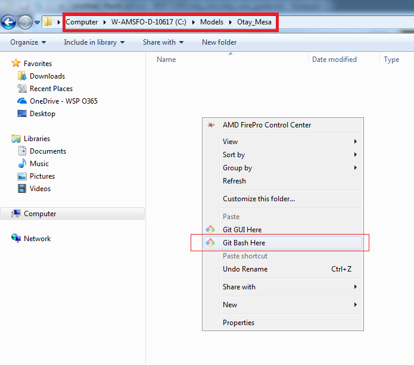  

3. You will see a Git command window open up 

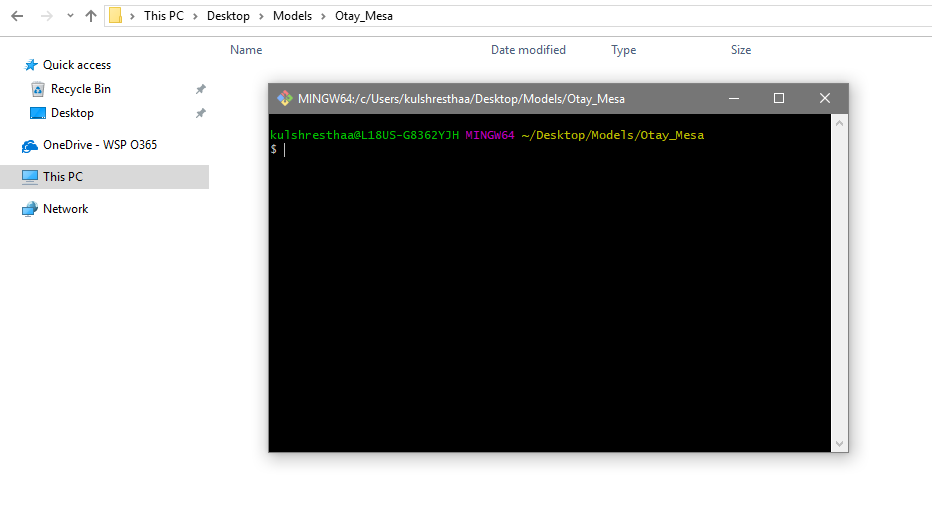

4. In this Git window, type `git clone https://github.com/SANDAG/SR11_OME_IG.git` and press Enter. Git will clone a copy of the model to your local directory. After the successful completion of model copy, the Git window should look like something below - 

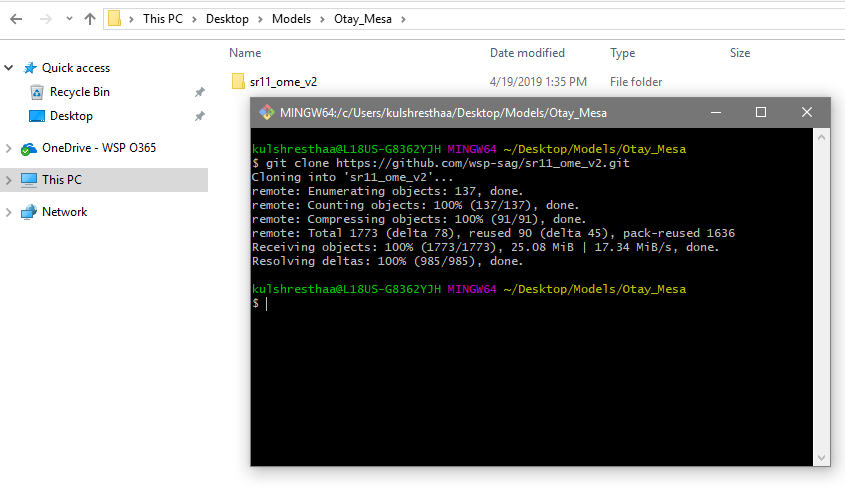

5. If you experience difficulties with Git and Cloning from GitHub, you could request a copy of the model from SANDAG staff.

6. Here is how the directory structure of the successfully installed Otay Mesa model should look - 

   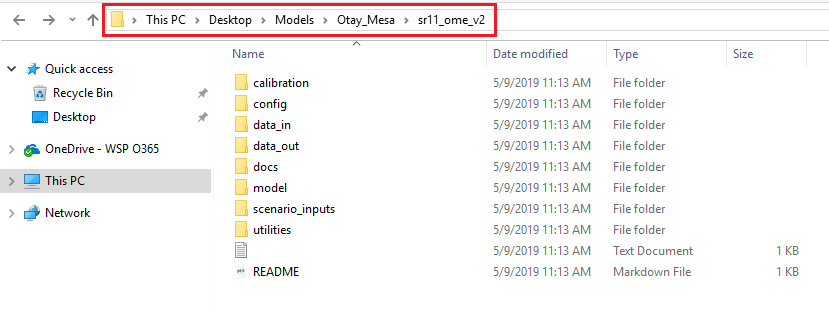

# Data and Software Needs

To run any model scenario, below are the list of inputs files you need to copy/setup - 

* Trip Tables
* Network 
* POE Rate File
* Properties File
* Run Configuration File 

**All of these scenario inputs for every model year are already located in the `scenario_inputs` folder of the model directory.** 

You will need to have R installed on your computer (version 3.5.1 was the version used to develop the model).  [Here](<https://cran.r-project.org/bin/windows/base/old/3.5.1/>) is the link to download R (3.5.1), if required. Any other newer R version (say 3.4.1 or 3.5.2 etc.) will work too. If this is the first time installing R on a machine, it is best to get the latest version. 

You will also need TransCAD 6.0 installed on your machine. The model was developed on TransCAD 6.0 with Build 9215 and was run on Build 9215 and 9065. 

**Install R Packages**

Several R packages need to be installed to run the port of entry model - `simmer`, `tidyverse`, `data.table`, `properties`, and `xlsx`. These R packages automatically get installed (is only done one time for any given machine) as part of model run but if you experience issues with running the R code for the model, you could try installing these packages manually. To do this: open the R program (go to `C:\Program Files\R` folder ->  select the R version folder -> go inside`bin\x64` folder -> right click on the R.exe and click on "Run as administrator. For R-3.5.1 installed on a machine, R program path will be `C:\Program Files\R\R-3.5.1\bin\x64\R.exe`) and copy/paste the following commands one at a time to install the required packages. If R asks for CRAN mirror to use, select USA (CA 1). **Again, this step s not required unless you experience R program errors with the model run.  The model won't run all the way through because certain files produced by the R code will be missing.  It is on WSP's to-do list to make the R package install procedure more robust so that this won't happen**. 

`install.packages("simmer")`

`install.packages("tidyverse")`

`install.packages("data.table")`

`install.packages("properties")`

`install.packages("xlsx")`

**Trips Tables**

Get the scenario-specific hourly (24) trip tables (.RDS format) from the input data location (`scenario_inputs`) and paste them in the `data_in\trip_tables\` folder.

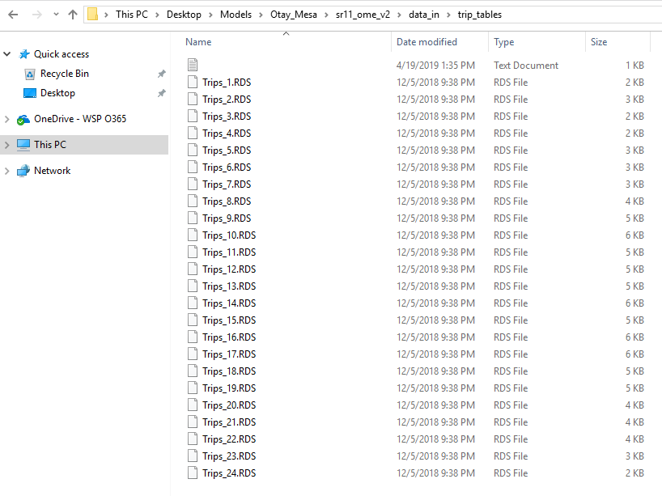

**Network**

Get the appropriate scenario network files from the scenario input folder and paste them in the `data_in\network\` folder.

In the snapshot below, 2040 build network is copied to set up the scenario. 

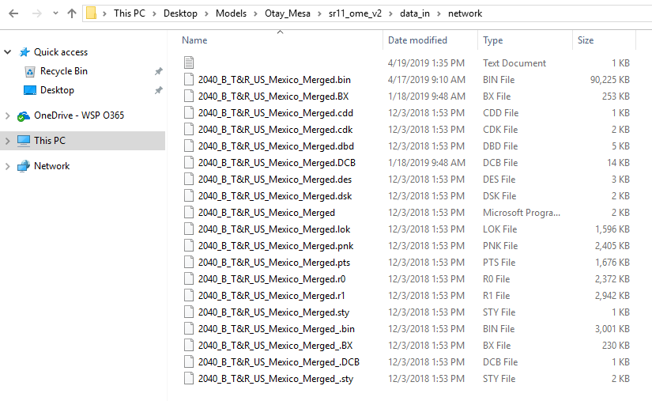

**POE Rate File**

The POE rate file defines the number of lanes and the processing rates by different lane types for each port of entry (POE). There are pre-defined poe rate files for the different scenarios in the scenario input folder location. If you need to run a scenario configuration for which a poe rate input file does not exist, see how to modify poe rate file [here](#revise-poe-rate-file).

Copy the poe rate file to the `data_in` folder. 

You can rename the poe rate file as needed, just make sure to use the correct name in setting up the [properties file](#properties-file).

**Properties and Configuration File**

Copy the properties (`sr11_ome.properties`) and run config (`run_config_xxx.csv`) file <u>from</u> the `scenario_inputs\config\` folder <u>to</u> the model `config` folder.  There are two config files, one for build scenarios and one for no-build scenarios. **Make sure you copy the appropriate file depending on the scenario you are trying to set up.**  Within each feedback loop, Port of Entry Choice model is run for 400 iterations and therefore the config file is defined for 400 iterations. If a different number for POE choice model iterations are desired, the config file needs to be updated accordingly. 

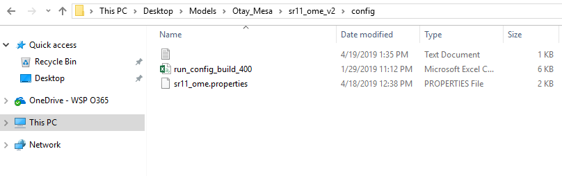

The configuration file defines the current iteration weight (for averaging of weight time by iteration) and whether or not the lane update and toll update modules will be run for that iteration. 

* `do_lane` is 1 for every 10th iteration - meaning the lane update module is set to run every 10th iteration. 
* `do_toll` is 1 (build scenarios) when you want to run the toll update module and 0 otherwise (no-build scenarios).

# Model Setup

**Properties File**

Once all the input data is copied to the appropriate locations, next step is to update the properties file to the local computer settings, file names etc. 

The highlighted properties from the snapshot below are the properties that need to be revised - 

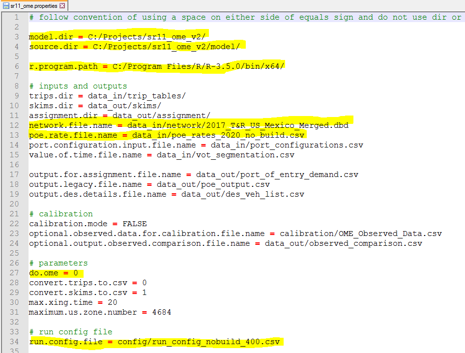 

 * `model.dir` is the location where you have installed the model. For the illustrations in this user guide, this will be set to `C:/sr11ome/SR11_OME_IG/`
* `source.dir` is the location of the model code. Example - `C:/sr11ome/SR11_OME_IG/model/`
* `r.program.path` is the location of the R program on the local machine. E.g., `C:/Program Files/R/R-3.5.1/bin/x64/`. 
* `network.file.name` Revise the name of the network .dbd file to the same name as the network you copied to the `data_in\network\` location
* `poe.rate.file.name` Revise the name of the poe rate file to the same name as the input file you copied to the `data_in\` location
* `do.ome` is 1 when you are running build scenario, 0 when running the no-build scenario. 
* `run.configuration.file` make sure the name of config file here is the same as what you copied to the `config` folder.

Once properties have been updated, be sure to SAVE the file and CLOSE it.  

**GISDK Code**

Go to the `model` directory and open the `run_poe_model.rsc` in a text editor. Revise the highlighted `property_file` variable to reflect the location of the properties file for this set up. Note the two back slashes ("\\\\")  in the path. 

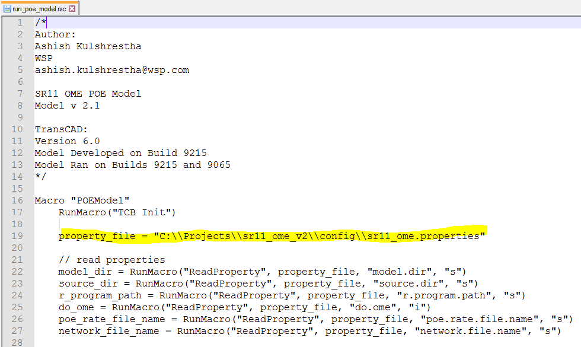

Once this path has been udpated, be sure to SAVE the file and CLOSE it.  

You are all set to run the Otay Mesa Model!

To summarize, here are the steps to SET UP the model - 

1. Clone or get the Otay Model
2. Copy scenario input files (trip tables, network, poe rate file), properties files and config file. 
3. Update properties file 
4. Update gisdk code file. 

# Running the Model

Running the model requires TransCAD (version 6) and R program installed on the machine. 

Open TransCAD software and look for GIS Developer's Kit option under Tools. 

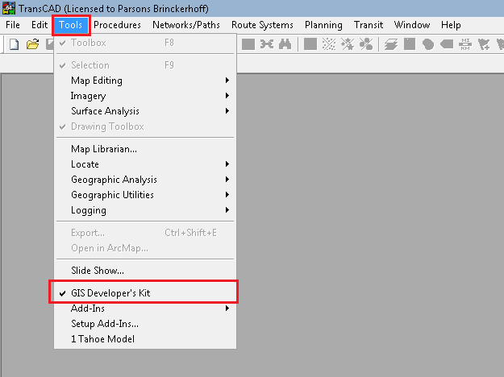

A GISDK toolbox will open up. From the toolbox, click on the `Compile` button [1] to compile the gisdk code. Browse to the location where you have the installed the Otay Mesa model, go into `model` folder and select `run_poe_model.rsc` file. You should see that the gisdk code gets compiled successfully. The Compile step is extremely quick and you won't see a progress bar. If there are any errors during the compilations, this step will not complete successfully.  

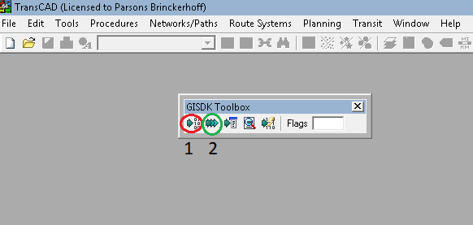

Next, click on the `test`button [2] from the toolbox, which is to run a `Macro` or `Dialog Box`. Keep the selection of "Type of Add-in" to`Macro` and type "POEModel" (without the quotes) in the Name. Click OK. This will start the scenario run for the Otay Mesa model. 

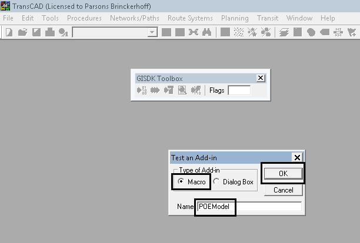

A scenario run takes about 3 to 4 days depending on the machine specs. Model is running 5 feedback loop of SKIM - POE CHOICE MODEL - ASSIGNMENT routine. Within each feedback loop, POE Choice Model is run for 400 iterations. During a model run. `run_log.txt` file in the `config` folder writes out the start date/time of each feedback loop and status of this file could be used to monitor the progress of the run. 

When the model run finishes successfully, you should see a a TransCAD popup window as below, confirming that the run has finished. 

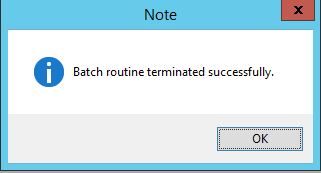

# Revise POE Rate File

If you are running a model scenario for a specific configuration and a pre-defined poe rate file does not exist in the scenario input folder, you can take any poe rate file, revise the lanes configuration as desired and save it to the `data_in` folder. 

Here is a snapshot of poe rate file 

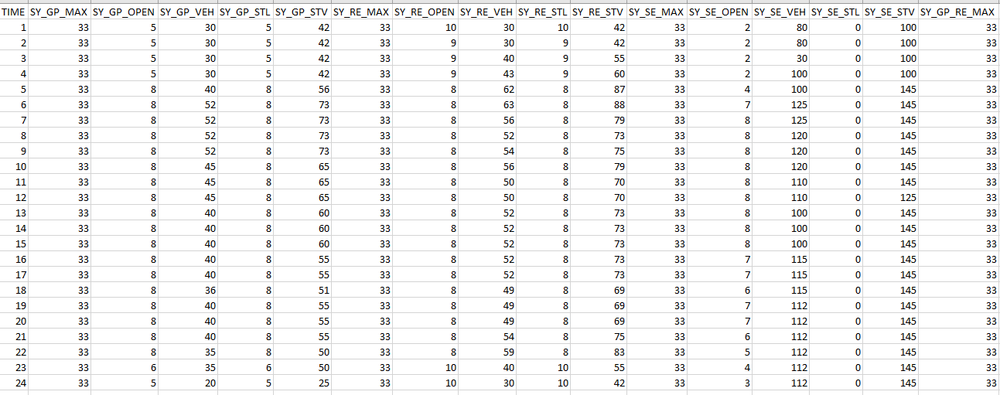

Below is the description of all the fields in the POE rate file. 

| FIELD       | DESCRIPTION                                                  | POE         |
| ----------- | ------------------------------------------------------------ | :---------- |
| TIME        | Time period. TIME is 1 for midnight to 1:00am; 24 for 11:00pm to midnight |             |
|             |                                                              |             |
| *_GP_MAX    | Max number of POV lanes for NB Direction                     | SY, OM, OME |
| *_GP_OPEN   | Open lanes for POV GP vehicles                               | SY, OM, OME |
| *_GP_VEH    | Processing rate for POV General vehicles (veh/hour/lane)     | SY, OM, OME |
| *_GP_STL    | Stacked lanes for POV General vehicles                       | SY, OM, OME |
| *_GP_STV    | Stacked Processing rate for POV General vehicles (veh/hour/lane) | SY, OM, OME |
|             |                                                              |             |
| *_RE_MAX    | Max number of POV lanes for NB Direction                     | SY, OM, OME |
| *_RE_OPEN   | Open lanes for POV NB Ready vehicles                         | SY, OM, OME |
| *_RE_VEH    | Processing rate for POV NB Ready vehicles (veh/hour/lane)    | SY, OM, OME |
| *_RE_STL    | Stacked lanes for POV NB Ready vehicles                      | SY, OM, OME |
| *_RE_STV    | Stacked Processing rate for POV NB Ready vehicles (veh/hour/lane) | SY, OM, OME |
|             |                                                              |             |
| *_SE_MAX    | Max number of POV lanes for NB Direction                     | SY, OM, OME |
| *_SE_OPEN   | Open lanes for POV NB SENTRI vehicles                        | SY, OM, OME |
| *_SE_VEH    | Processing rate for POV NB Ready vehicles (veh/hour/lane)    | SY, OM, OME |
| *_SE_STL    | Stacked lanes for POV NB Ready vehicles                      | SY, OM, OME |
| *_SE_STV    | Stacked Processing rate for POV NB Ready vehicles (veh/hour/lane) | SY, OM, OME |
|             |                                                              |             |
| *_SB_MAX    | Max number of POV lanes for SB Direction                     | SY, OM, OME |
| *_SB_OPEN   | Open lanes for POV SB vehicles                               | SY, OM, OME |
| *_SB_VEH    | Processing rate for POV SB vehicles (veh/hour/lane)          | SY, OM, OME |
| *_SB_STL    | Stacked lanes for POV SB vehicles                            | SY, OM, OME |
| *_SB_STV    | Stacked Processing rate for POV SB vehicles (veh/hour/lane)  | SY, OM, OME |
|             |                                                              |             |
| *_GP_RE_MAX | Max lane constraint on total of General and Ready Lanes in NB Direction | SY, OM      |
|             |                                                              |             |
| *C_GP_MAX   | Max number of COM lanes for NB Direction                     | OM, OME     |
| *C_GP_OPEN  | Open lanes for COM NB General (Non-Fast) vehicles            | OM, OME     |
| *C_GP_VEH   | Processing rate for COM NB General (Non-Fast) vehicles (veh/hour/lane) | OM, OME     |
| *C_GP_STL   | Stacked lanes for COM NB General (Non-Fast) vehicles         | OM, OME     |
| *C_GP_STV   | Stacked Processing rate for COM NB General (Non-Fast) vehicles (veh/hour/lane) | OM, OME     |
|             |                                                              |             |
| *C_SP_MAX   | Max number of COM lanes for NB Direction                     | OM, OME     |
| *C_SP_OPEN  | Open lanes for COM NB Special (Fast) vehicles                | OM, OME     |
| *C_SP_VEH   | Processing rate for COM NB Special (Fast) vehicles (veh/hour/lane) | OM, OME     |
| *C_SP_STL   | Stacked lanes for COM NB Special (Fast) vehicles             | OM, OME     |
| *C_SP_STV   | Stacked Processing rate for COM NB Special (Fast) vehicles (veh/hour/lane) | OM, OME     |
|             |                                                              |             |
| *C_SB_MAX   | Max number of COM lanes for SB Direction                     | OM, OME     |
| *C_SB_OPEN  | Open lanes for COM SB vehicles                               | OM, OME     |
| *C_SB_VEH   | Processing rate for COM SB vehicles (veh/hour/lane)          | OM, OME     |
| *C_SB_STL   | Stacked lanes for COM SB  vehicles                           | OM, OME     |
| *C_SB_STV   | Stacked Processing rate for COM SB vehicles (veh/hour/lane)  | OM, OME     |

***Key considerations when changing poe rate file:***

- Note that `*_GP_MAX`, `*_RE_MAX`, and `*_SE_MAX` for the Northbound direction are same values. This is the max total lanes for POV NB direction for that port. Example, if you need to change the total lanes for SY-POV-NB from say 33 to 25, change all the three columns `SY_GP_MAX`, `SY_RE_MAX` and `SY_SE_MAX` to 25. 

- Similarly, `*C_GP_MAX` and `*C_SP_MAX` are the same max total lanes for COM NB direction for that port. For example, if you want to do a scenario run with total 10 COM lanes at OM, update the columns `OMC_GP_MAX` and `OMC_SP_MAX` to 10.  

- Stacked lanes (STL) are only allowed for San Ysidro General and Ready Lanes. Therefore, stacked open lanes and stacked processing rates for other POEs and Lane Types in this poe rate file does not matter (preferably should be zero for them). The number of stacked lanes cannot exceed the number of OPEN lanes but it can be equal to the number of OPEN lanes.  For example, if number of OPEN lanes is 10 and STL lanes is 7, it means that of the 10 open lanes, 7 are stacked (and uses stacked processing rate) and 3 are not stacked (using regular processing rate).  

- If you change the MAX lanes or OPEN lanes, make sure that the total of open lanes by lane types does not exceed max lanes for that port for each hour. For example, the sum of `SY_GP_OPEN`, `SY_RE_OPEN`, and `SY_SE_OPEN` should not exceed `SY_GP_MAX` (or `SY_RE_MAX` or `SY_SE_MAX`). Similarly, for only one lane type (i.e., Southbound), OPEN lanes should not exceed MAX lanes (e.g., `OM_SB_OPEN` should be less than or equal to`OM_SB_MAX`)

- If you are running a no-build scenario, DO NOT include the columns for Otay Mesa East (OME) in the poe rate file. 

- `SY_GP_RE_MAX` and `OM_GP_RE_MAX` columns are used to set a max lane constraint on the sum of Northbound General and Ready lanes for the San Ysidro and Otay Mesa POE respectively. If it is NOT required to have such constraint, keep the values in these columns same as Northbound MAX lanes (`*_GP_MAX`, `*_RE_MAX`, `*_SE_MAX`) for that POE. For example, `SY_GP_RE_MAX` value as 33 (same as POV NB MAX lanes) ensures there is no GP + RE max lane constraint for San Ysidro. 

- For running 2040 scenario with different lane configurations - you need to change the MAX lanes columns for OME. For example, if you want to run a 7 x 5 configuration (meaning 7 POV lanes and 5 COM lanes) - change `OME_GP_MAX`, `OME_RE_MAX`, `OME_SE_MAX`, and `OME_SB_MAX` to 7 lanes and change `OMEC_GP_MAX`, `OMEC_SP_MAX` and `OMEC_SB_MAX` to 5 lanes. 

-  As a general guideline, maintain the approximate relationship between MAX lanes and OPEN lanes.  If you increase MAX lanes from the current value, then increase the OPEN lanes or vice versa.  The lane optimization procedure changes the open lanes to maximize throughput so the values in the POE rates file is just the starting point.  As noted above, be sure to check that the number of OPEN lanes across all lane types does not exceed MAX lanes for a particular port.

# Model Outputs

This model generates a few different output files in the `data_out` folder. The key output files from the model run are `poe_results.csv` and `results.xlsx`. These two files contain the same outputs but in different formats. The model output produces final `open lanes`, `wait time`, `volume`, `queue`, and `toll` for each port of entry and lane/vehicle type configuration by hour. 

We define `wait time` as the amount of time that all vehicles that arrived in a given hour wait to get processed through primary inspection. Vehicles may actually be processed in a future hour, but their wait time is captured in the hour in which they arrived.

We define `queue` as the number of vehicles still waiting to cross at the end of a given hour.

We define `toll` as the monetary value (2017 USD) charged to vehicles processed (cleared primary inspections) in a given hour.

Here is a snapshot of how the `poe_results.csv` file looks -

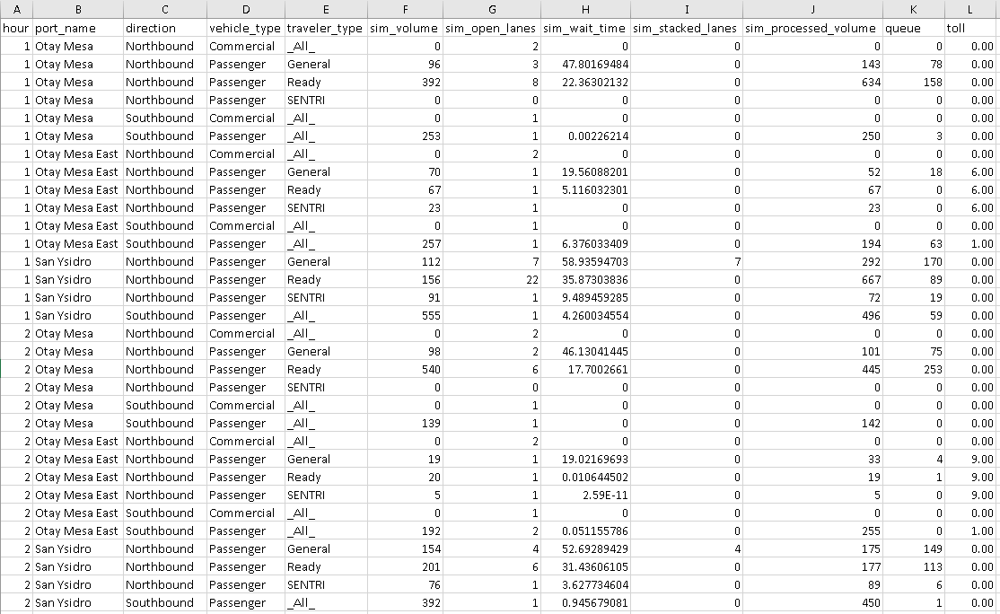

There are skims and assignment results for every hour in the respective folder. The model is run for 5 global feedback loops and the outputs from each loop are also saved in the `output_n` folder. 
